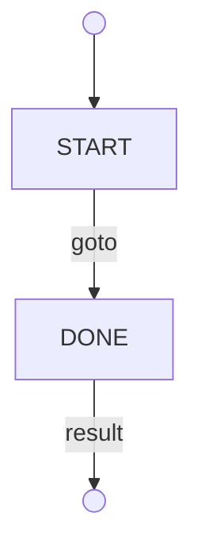

# raymond diagram

The `raymond diagram` subcommand generates a visual Mermaid flowchart of a
workflow's state transitions. It scans a workflow directory or zip archive,
parses every state file, and produces a directed graph showing all transitions
between states.

Default output is Mermaid text written to stdout. With `--html`, it produces
a self-contained interactive HTML file instead.

## Usage

```
raymond diagram <path>
```

`<path>` is a workflow directory or zip archive.

### Flags

| Flag | Default | Description |
|------|---------|-------------|
| `--win` | false | Include Windows script files (`.bat`, `.ps1`) and exclude Unix scripts (`.sh`). Default (no flag) includes `.sh` and excludes `.bat`/`.ps1`. |
| `--html` | false | Write an interactive HTML file instead of printing Mermaid text to stdout. |
| `--output <filename>` | `diagram.html` | Filename for HTML output. Only meaningful with `--html`. Using `--output` without `--html` is an error. |

### Examples

Print Mermaid flowchart to stdout:

```
raymond diagram ./my-workflow
```

Generate an interactive HTML file (written to `diagram.html`):

```
raymond diagram --html ./my-workflow
```

Generate HTML with a custom output filename:

```
raymond diagram --html --output review.html ./my-workflow
```

Diagram a zip archive in Windows mode:

```
raymond diagram --win workflow.zip
```

## Mermaid text output

The Mermaid output is a `flowchart TD` (top-down) graph.

### Synthetic entry and exit nodes

- A synthetic `__start__` node (circle) is emitted and connected with a solid
  arrow to the workflow's entry-point state.
- For each terminal state — a state that emits `<result>` and is not inside any
  `<call>` or `<function>` sub-call — a synthetic `__end_N__` node (circle) is
  emitted with a solid arrow labeled `result` from the terminal state.

### Node shapes

| State type | Mermaid shape | Syntax |
|------------|---------------|--------|
| Markdown (`.md`) | Rectangle | `id["label"]` |
| Script (`.sh`, `.bat`, `.ps1`) | Hexagon | `id{{"label"}}` |
| External workflow reference (cross-workflow tag target) | Double bracket | `id[["label"]]` |

Missing nodes — states referenced in transitions but with no corresponding file
in the workflow — are rendered with a dashed outline:

```
style missing_state stroke-dasharray: 5 5
```

### Edge styles

| Transition type | Arrow style |
|-----------------|-------------|
| `<goto>`, `<call>`, `<function>`, `<call-workflow>`, `<function-workflow>`, `fork-next`, `fork-workflow-next`, `<await>` | Solid `-->` |
| `<fork>`, `<fork-workflow>`, `<reset>`, `<reset-workflow>`, return edges, `<await>` timeout | Dashed `-.->` |

**`<await>` edges:** An `<await>` transition produces a solid edge labeled
`await` from the current state to the `next` target. If `timeout_next` is
specified, a second dashed edge labeled `await timeout` is drawn to the timeout
target. Both edges from frontmatter declarations and body-parsed `<await>` tags
are rendered.

**Return edges** come in two forms:

- *Traced returns* (`<call>`, `<function>`) — raymond traces which states inside
  the called sub-graph eventually emit `<result>` and draws a dashed return edge
  from each such state back to the `return` state. The label is
  `return (caller-name)`. The tracing follows `<goto>`, `<reset>`, and `<await>`
  edges when building the reachability graph.
- *Explicit cross-workflow returns* (`<call-workflow>`, `<function-workflow>`) —
  when a `return` attribute is present, a single dashed edge is drawn from the
  calling state to the return state, labeled `call-workflow return` or
  `function-workflow return`. Raymond cannot trace inside an external workflow,
  so result-based tracing is not performed for cross-workflow calls.

Mermaid has no separate dotted line type; `<reset>` and `<reset-workflow>` edges
render identically to other dashed edges.

### Illustrative example

A minimal two-state workflow (`START.md` → `DONE.md`) would produce:



## HTML mode (`--html`)

With `--html`, `raymond diagram` writes a self-contained interactive HTML file
instead of printing Mermaid text.

### Layout

The HTML page is split into two panels:

- **Left panel** — the rendered Mermaid diagram.
- **Right panel** — a content viewer. Clicking any node loads that state's file
  content into this panel.

### Content rendering

- Markdown files (`.md`) are rendered as formatted HTML using
  [marked.js](https://marked.js.org/).
- Script files (`.sh`, `.bat`, `.ps1`) are shown as plain text in a `<pre>`
  block.

### Embedded content and CDN dependencies

State file contents are embedded in the HTML file at generation time. The file
can be shared and viewed without access to the original workflow directory.

However, the JavaScript libraries are loaded from CDN at view time:

- `mermaid.min.js` — from `cdn.jsdelivr.net`
- `marked.min.js` — from `cdn.jsdelivr.net`

Viewing the HTML file in a browser requires internet access to
`cdn.jsdelivr.net`.

### Output file

The HTML is written to the path given by `--output` (default: `diagram.html`).
The file is created or overwritten in the current working directory unless an
absolute or relative path is given.

## ZIP archive support

`raymond diagram` accepts a zip archive as `<path>`. Hash validation and layout
detection follow the same rules as `raymond lint`: the SHA256 hash embedded in
the filename is verified before processing, and both flat and single-folder
archive layouts are supported transparently.
